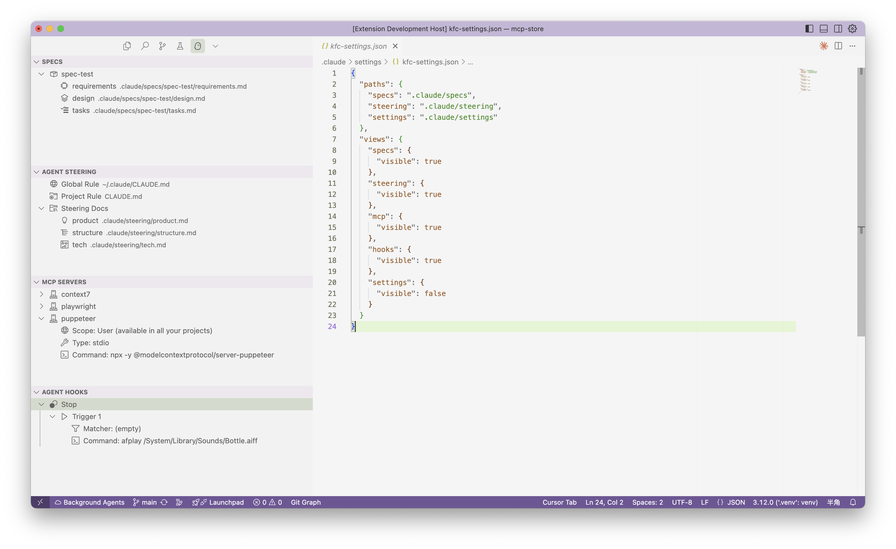

# Kiro for Claude Code

[](https://marketplace.visualstudio.com/items?itemName=heisebaiyun.kiro-for-cc)
[](https://marketplace.visualstudio.com/items?itemName=heisebaiyun.kiro-for-cc)

[中文版](./README.zh-CN.md)

A VSCode extension that brings spec-driven development to Claude Code. Manage your specs and steering documents visually while leveraging Claude Code's powerful AI capabilities.

## Features

### 📝 SPEC Management

- **Create Specs**: Generate requirements, design, and task documents with Claude's help
- **Visual Explorer**: Browse and manage specs in the sidebar
- **Spec Workflow**: Requirements → Design → Tasks with review at each step

### 🎯 STEERING Management

- **CLAUDE.md**: Browse and edit global/project-specific guidelines
- **Generated Docs**: Product, tech, and structure steering documents

### 🔌 MCP Management

- **MCP Servers**: View configured global and workspace MCP servers

### 🪝 HOOKS Management

- **Agent Hooks**: View Claude Code hooks

### ⚙️ Others

- **Settings Management**: Centralized configuration

## Screenshot



*The extension provides a comprehensive sidebar interface with organized views for specs, steering documents, MCP servers, and hooks management. All your Claude Code enhancement tools in one place.*

## Installation

### From Extension Marketplace

**VSCode users:**
1. Open VSCode
2. Go to Extensions (Cmd+Shift+X)
3. Search for "Kiro for Claude Code"
4. Click Install

Or via command line:
```bash
code --install-extension heisebaiyun.kiro-for-cc
```

**Cursor users:**
The extension is available on OpenVSX Registry. In Cursor:
1. Go to Extensions
2. Search for "Kiro for Claude Code"
3. Click Install

Or via command line:
```bash
cursor --install-extension heisebaiyun.kiro-for-cc
```

### From VSIX file

```bash
# VSCode
code --install-extension kiro-for-cc-0.1.0.vsix

# Cursor
cursor --install-extension kiro-for-cc-0.1.0.vsix
```

### Prerequisites

1. **Claude Code Installation**: Ensure Claude Code is installed and configured

2. **Platform Compatibility**: 
   
   **macOS & Linux**: ✅ Fully supported without any additional configuration
   
   **Windows**: Special requirements due to technical limitations
   
   Due to Claude Code's interactive terminal interface requirements, pipe/redirect operations are not supported in native Windows terminals (CMD, PowerShell, Git Bash).
   
   **Supported Environments:**
   - ✅ **macOS/Linux**: All terminals work perfectly
   - ✅ **WSL VSCode + WSL Terminal**: Full native Linux environment
   - ✅ **Windows VSCode + WSL Terminal**: Automatic path conversion supported
   - ❌ **Windows Native Terminals**: Not supported (CMD, PowerShell, Git Bash)
   
   **Technical Background:**
   - Claude Code requires a TTY (terminal) environment for its interactive interface
   - Windows terminals break the TTY connection when using pipes (`|`) or redirects (`<`)
   - This limitation affects all Windows terminals including Git Bash (MinTTY)
   
   **Recommendation for Windows Users:**
   - Install WSL2 (Windows Subsystem for Linux)
   - **Best Practice**: Launch VSCode from within WSL (`code .` in WSL terminal)
   - **Alternative**: Use WSL terminal within Windows VSCode (extension handles path conversion automatically)

## Usage

### Creating a Spec

1. Click the Kiro for CC icon in the activity bar
2. In the SPEC view, click the `+` button
3. Enter a feature description
4. Claude will generate the requirements document
5. Review and approve before proceeding to design
6. Generate tasks after design is complete

### Spec Workflow

1. **Requirements**: Define what you want to build
2. **Design**: Create technical design after requirements approval
3. **Tasks**: Generate implementation tasks after design approval
4. **Implementation**: Execute tasks one by one

### Steering Documents

Create project-specific guidance:

- Click ✨ icon to create custom steering
- Generate initial docs (product, tech, structure)
- Documents are stored in `.claude/steering/`

## Configuration

Settings are stored in `.claude/settings/kfc-settings.json`:

```json
{
  "paths": {
    "specs": ".claude/specs",
    "steering": ".claude/steering",
    "settings": ".claude/settings"
  },
  "views": {
    "specs": {
      "visible": true
    },
    "steering": {
      "visible": true
    },
    "mcp": {
      "visible": true
    },
    "hooks": {
      "visible": true
    },
    "settings": {
      "visible": false
    }
  }
}
```

## Workspace Structure

The extension creates the following structure in your workspace:

```plain
.claude/                      # Extension data directory
├── specs/                    # Feature specifications
│   └── {spec-name}/
│       ├── requirements.md   # What to build
│       ├── design.md        # How to build
│       └── tasks.md         # Implementation steps
├── steering/                # AI guidance documents
│   ├── product.md          # Product conventions
│   ├── tech.md             # Technical standards
│   └── structure.md        # Code organization
├── settings/
│   └── kfc-settings.json   # Extension settings
```

## Development

### Prerequisites

- Node.js 16+
- VSCode 1.84.0+
- TypeScript 5.3.0+

### Setup

```bash
# Clone the repository
git clone https://github.com/notdp/kiro-for-cc.git
cd kiro-for-cc

# Install dependencies
npm install

# Compile TypeScript
npm run compile

# Watch mode (auto-compile on changes)
npm run watch
```

### Running the Extension

1. Open the project in VSCode
2. Press `F5` to launch Extension Development Host
3. The extension will be available in the new VSCode window

### Building

```bash
# Build VSIX package
npm run package

# Output: kiro-for-cc-0.1.0.vsix
```

### Project Structure

```plain
src/
├── extension.ts              # Extension entry point, command registration
├── constants.ts              # Configuration constants
├── features/                 # Business logic
│   ├── spec/
│   │   └── specManager.ts    # Spec lifecycle management
│   └── steering/
│       └── steeringManager.ts # Steering document management
├── providers/                # VSCode TreeDataProviders
│   ├── claudeCodeProvider.ts # Claude CLI integration
│   ├── specExplorerProvider.ts
│   ├── steeringExplorerProvider.ts
│   ├── hooksExplorerProvider.ts
│   ├── mcpExplorerProvider.ts
│   └── overviewProvider.ts
├── prompts/                  # AI prompt templates
│   ├── specPrompts.ts        # Spec generation prompts
│   └── steeringPrompts.ts    # Steering doc prompts
└── utils/
    └── configManager.ts      # Configuration management
```

### Key Architecture Concepts

- **Manager Pattern**: Each feature has a Manager class handling business logic
- **Provider Pattern**: Tree views extend `vscode.TreeDataProvider`
- **Command Pattern**: All commands follow `kfc.{feature}.{action}` naming
- **Configuration**: Centralized through `ConfigManager` for flexibility

## License

MIT License - see [LICENSE](./LICENSE) for details
